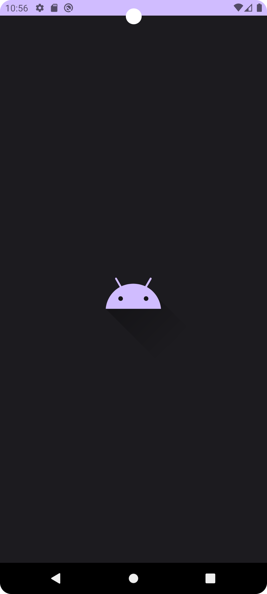

# **YouTube Converter for Android**

## **Description**

The **YouTube Converter** is a powerful and easy-to-use Android application designed to help users download videos, audio, and entire playlists from YouTube. With its intuitive interface, users can effortlessly convert YouTube content into various formats, including MP3 for audio and MP4 for video, without needing any technical expertise. Whether you're downloading a single video or an entire playlist, the YouTube Converter works seamlessly in the background, allowing users to choose the highest available video resolution for MP4 downloads or extract audio in MP3 format.

---

## **Demonstration**

Here’s a quick demonstration of **YouTube Converter** in use:


This demonstration showcases the main functionality of the app, including video and playlist downloads, as well as MP3 conversions.

---

## **Key Features**
- **YouTube to MP3 Converter**: Converts a single YouTube video into an MP3 audio file.
- **YouTube Playlist to MP3 or MP4 Converter**: Converts all videos in a playlist to MP3 audio files or downloads them as MP4 videos in the highest available resolution. A list of all YouTube links and titles will be generated in the same folder where the files are downloaded.
- **YouTube to MP4 Converter**: Downloads individual YouTube videos in MP4 format, offering the option to select the highest resolution.
- **MP4 to MP3 Converter**: Converts local MP4 files on your device to MP3 audio.
- **Custom Splash Screen**: A branded splash screen that displays when the app launches, enhancing user experience.
---
## **Installation and Setup**

### **For All Users**:
1. Download the APK from the [release](https://github.com/Glooring/youtube-converter-android/releases) folder or directly using [this link](https://github.com/Glooring/keycrypt-android/raw/refs/heads/main/release/youtube-converter-v1.0.apk).
2. Install the APK on your Android device.
3. Grant the necessary permissions (Internet, Storage, Foreground Service).

### **For Developers**:

1. Clone the repository:
    ```bash
    git clone https://github.com/Glooring/youtube-converter-android.git
    ```
2. Open the project in **Android Studio Koala (2024.1.1)**.
3. Sync the project with Gradle by opening the `build.gradle.kts` file.

#### **Running in Simulation Mode:**
If you want to run the app in simulation mode, you need to set the `abiFilters` for all architectures:

In `build.gradle.kts`, make sure the following line is **uncommented**:
```kotlin
ndk {
    abiFilters += listOf("arm64-v8a", "x86_64", "x86")
    // abiFilters.add("arm64-v8a")
    // abiFilters.add("x86_64")
}
```

---

#### **Building a Release APK:**
For building the release APK, comment out the list-based `abiFilters` and only use the `arm64-v8a` architecture:

In `build.gradle.kts`, use the following configuration:
```kotlin
ndk {
    // abiFilters += listOf("arm64-v8a", "x86_64", "x86")
    abiFilters.add("arm64-v8a")
    // abiFilters.add("x86_64")
}
```

4. Build and run the project on your device or emulator.

---

## **How it Works**

The app integrates a Python script, `download_youtube.py`, to handle the core functionality. It supports downloading YouTube videos and playlists as MP3 or MP4 files in the highest resolution.

### **Main Functions:**

1. **Download YouTube Audio**: Extracts and downloads the highest bitrate audio from a YouTube video.
2. **Extract Playlist Links**: Fetches video links and titles from a YouTube playlist for conversion.
3. **Fetch Video Resolutions**: Retrieves available video resolutions for the user to choose from.
4. **Download Video and Audio Separately**: Downloads video without audio and merges them using FFmpeg for high-quality MP4 output.
5. **Save Playlist Information**: Generates a text file listing all links and titles from a playlist in the same folder as the downloaded files.

### **Key Python Functions:**
- **`download_audio(youtube_link, output_dir)`**: Downloads the highest bitrate audio stream from a YouTube video.
- **`is_youtube_link_valid(url)`**: Validates a YouTube video link.
- **`is_youtube_playlist_link_valid(url)`**: Validates a YouTube playlist link.
- **`extract_playlist_links_and_titles(playlist_url)`**: Extracts video links and titles from a YouTube playlist.
- **`get_available_resolutions(youtube_link)`**: Fetches available video resolutions for a YouTube video.
- **`get_highest_resolution(youtube_link)`**: Retrieves the highest video resolution for a YouTube video.
- **`download_video_no_audio(youtube_link, resolution, output_dir)`**: Downloads a video without audio in the selected resolution.
- **`download_video_audio(youtube_link, output_dir)`**: Downloads only the audio stream of a YouTube video.
- **`merge_video_and_audio(video_path, audio_path, output_path)`**: Merges video and audio files using FFmpeg.

### **Key Kotlin Classes:**
- **`MainActivity.kt`**: Handles user interactions, including navigating through the app and starting media conversions.
- **`MainViewModel.kt`**: Manages the app's state and controls the background tasks for media downloading and conversions.
- **`ForegroundService.kt`**: Manages background tasks for downloading and converting YouTube media, such as YouTube to MP3 or MP4 conversion and playlist processing.
- **`ToastUtil.kt`**: Displays toast messages throughout the app to provide user feedback.
---

## **Technologies Used**
- **Android Studio Koala (2024.1.1)**: The IDE used for app development.
- **Kotlin**: Main programming language for the Android codebase.
- **Chaquopy**: Python integration plugin for running Python scripts within Android.
- **pytubefix**: A Python library used to interact with YouTube, download videos, and extract audio.
- **Mobile FFmpeg**: For handling audio and video conversions, including converting MP4 to MP3 and merging video and audio streams.
- **Compose UI**: For building the user interface.
- **Gradle (Kotlin DSL)**: Build system used to manage dependencies and build processes.

---

## **Project Structure**
```
YouTube Converter/
│
├── .idea/                               # IntelliJ IDEA project configuration files
├── app/                                 # Main app source code
│   ├── build.gradle.kts                 # App-specific Gradle build file
│   ├── src/                             # Source code and resources
│   │   ├── main/                        # Main application folder
│   │   │   ├── java/                    # Kotlin source files for the app
│   │   │   │   └── com/example/youtubeconverter/
│   │   │   │       ├── MainActivity.kt      # Main Activity for the app
│   │   │   │       ├── MainViewModel.kt     # ViewModel handling app logic
│   │   │   │       ├── ForegroundService.kt # Foreground service for background downloads
│   │   │   │       ├── ToastUtil.kt         # Utility class for displaying toasts
│   │   │   ├── python/                  # Python scripts
│   │   │   │   └── download_youtube.py  # Main Python script for handling YouTube downloads
│   │   │   ├── res/                     # App resources (images, layouts, etc.)
│   │   │   │   ├── drawable/            # Icons and splash background
│   │   │   │   ├── mipmap/              # Launcher icons
│   │   │   │   └── values/              # Theme colors and styles
├── gradle/                              # Gradle wrapper files
├── media/                               # Contains media assets such as GIFs or images (e.g., demonstration GIF) 
├── release/                             # APK and other release artifacts
│   └── youtube-converter-v1.0.apk    	 # Compiled APK file
├── LICENSE                   			 # License information for the project
├── README.md                            # Project documentation
├── build.gradle.kts                     # Kotlin-based Gradle build file
├── gradle.properties                    # Gradle configuration properties
├── gradlew                              # Gradle wrapper for Unix/Linux
├── gradlew.bat                          # Gradle wrapper for Windows
└── settings.gradle.kts                  # Multi-project build settings

```
---

## **Permissions**
The app requires the following permissions:
- **Internet Access**: To download videos and audio from YouTube.
- **Storage Access**: To save the downloaded files on your device.
- **Foreground Service**: To handle background tasks during media downloads.

---

## **Splash Screen**
The app includes a custom splash screen that enhances the user experience during app startup.

Example Screenshot:



---

## **Acknowledgments**
- **Chaquopy**: For seamless Python integration into Android.
- **Mobile FFmpeg**: For media conversion.
- **pytubefix**: For downloading and interacting with YouTube content.

---

## **Future Improvements**
- **Playlist to MP4**: Already supported, but could include more resolution options for customization.
- **Enhanced Video Quality Control**: Allow users to select video quality more granularly for downloads.
- **Custom Download Locations**: Allow users to choose where to save the downloaded files on their devices.

---

## **License**
This project is licensed under the **MIT License**. See the `LICENSE` file for more details.